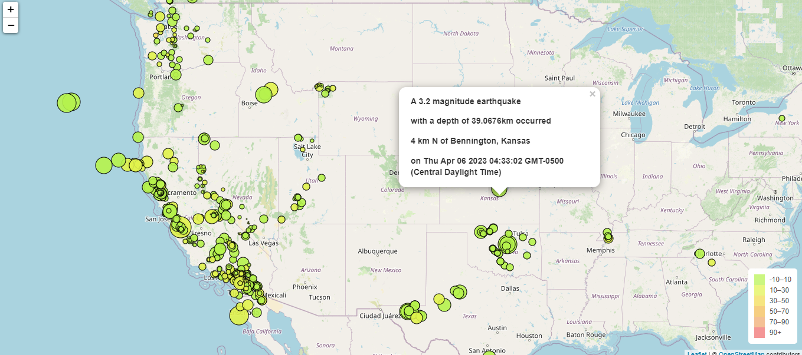
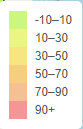
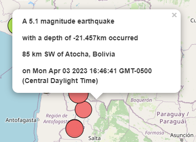

# leaflet-challenge ReadMe

### Earthquake Visualization

This code uses Leaflet.js and [USGS GeoJSON Feed](http://earthquake.usgs.gov/earthquakes/feed/v1.0/geojson.php) to create an interactive map displaying earthquake data from the past 7 days. The map uses markers with popups to share information about the location, date and time, magnitude, and type (earthquake or quarry). The markers also reflect the magnitude by their size and depth by color. A legend is included to provide context.

Functions:

1. The `<createMap>` function uses the openstreetmap as a base layer and overlays with the earthquake markers array. A legend is then added to the bottom right of the screen to provide context to the colored markers indicating the depth of the earthquake.

   
2. The `<createMarkers>` function processes the earthquake data as a response object and creates a circle marker using the earthquake coordinates. It then binds a popup including the magnitude, type, depth, place, and date and time of occurrance. A `<getValue>` function returns an associated color for the depth value to be used for the marker.

An API call to the USGS to get the information is then made, which then calls to `<createMarkers>` when it completes.
